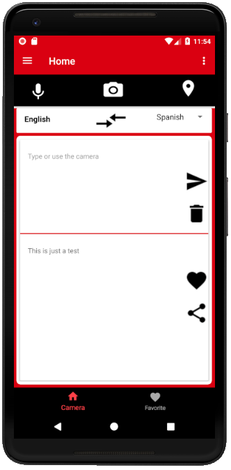

<h3 align="center">
CameraTranslate app
</h3>

# CameraTranslate app 
An app that can scan images and translate it 

# What's CameraTranslate? 
- An app that can scan images and translate words to another language
- The main idea is to extract text from an image using OCR. 

## Functionality
- Users can scan using camera and extract text. 
- Once you tap the text, It will be automatically converted 
- Double tapping will send the selected text to different screen
- Users can save the words for future use
- Users can share the words to social medias
- Users can use speech to text for translation
- Users can memorize saved words using swipecards 

## Demo and Screenshots

  
  
  

# Sprint 1 Plan 
### TODO
- Week 1:
- [x] Create an onbording screen 
- [x] Design main screens and layouts 
- [x] Work with the Camera 
- [x] Start working on OCR open source library for text extraction 
- Week 2:  
- [x] Continue working on OCR and try to get it done by this week. 
- [ ] Update the listview to recyclerview 
- [x] fetch the data in a dynamic way 

# Sprint 2 - 3 Plan: 
### TODOS

- [ ] ripple effect when bottom navigation is switched ( see google play store view pager tab)
- [x] make the showcase view background little nicer 
- [x] remove the '[]' from the output 
- [x] translate it when user stops typing or press backbitten 
- [ ] make RecyclerView items deletable by id 
- [x] make camera screen more nicer ( look dictionary and yonder app for this) 

